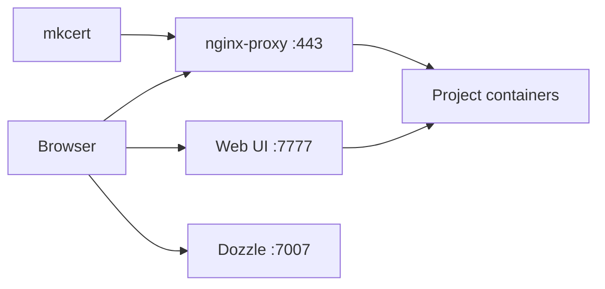

# Getting started

Install Docker, clone this repo, start Nginx, then create a project. After that you can use `docker-env` from any directory or the [Web UI](web-ui.md).

## Requirements

Install these on the host (not inside a container):

1. [Docker Engine](https://docs.docker.com/engine/install/) **20.10+** with **Compose v2** (`docker compose`). Docker Desktop includes Compose v2.
2. [jq](https://jqlang.github.io/jq/download/)
3. [Node.js](https://nodejs.org/) (needed to run the CLI healthcheck)

Linux: install the Compose plugin if `docker compose version` fails. Compose v1 (`docker-compose`) is no longer supported.

## Install

From the repository root:

```bash
./setup.sh
```

The first run adds a `docker-env` alias and `DOCKER_ENV_DIR` to your shell rc file (`.zshrc`, `.bashrc`, or `.profile`). Restart the terminal, or `source` that file.

Then, from any directory:

```bash
docker-env
```

Same as `./setup.sh` from the repo.


## Start Nginx

Projects need the shared proxy. In the CLI:

1. **1 — System Services**
2. **1 — Nginx**
3. **1 — Setup**

That creates the `dockerwp` network and `ssl-certs` volume, then starts `nginx-proxy`, `nginx-mkcert`, and `nginx-dozzle`. It also tries to start the Web UI at [http://127.0.0.1:7777](http://127.0.0.1:7777).


Trust the local CA once: [System: certificates](system.md#trust-the-local-ca).

## Create a project

1. **2 — New project**
2. Pick a type (see [projects](README.md#projects))
3. Enter a short domain name (example: `blog`)
4. Confirm `DOMAIN_FULL` (default is usually `dev.blog.local`)
5. Confirm the summary with `y`

On macOS and Linux the CLI appends `127.0.0.1` lines to `/etc/hosts` (sudo). On Windows, add the printed lines yourself: [hosts](system.md#hosts-file).

Open `https://dev.blog.local` (HTTPS on port **443**).


## Everyday commands

| Goal | CLI | Web UI |
| --- | --- | --- |
| Start / stop / rebuild a site | **3 → 1 Docker** | Card actions |
| Import / export DB | **3 → 2 Database** | — |
| Shell in the app container | **3 → 3 CLI** | — |
| List sites | **3 → 4** | Home list |
| Container logs | Dozzle | Card → logs |

Dozzle: [http://127.0.0.1:7007](http://127.0.0.1:7007)

## What you should see



Next: [system services](system.md) or a [project type](README.md#projects).
